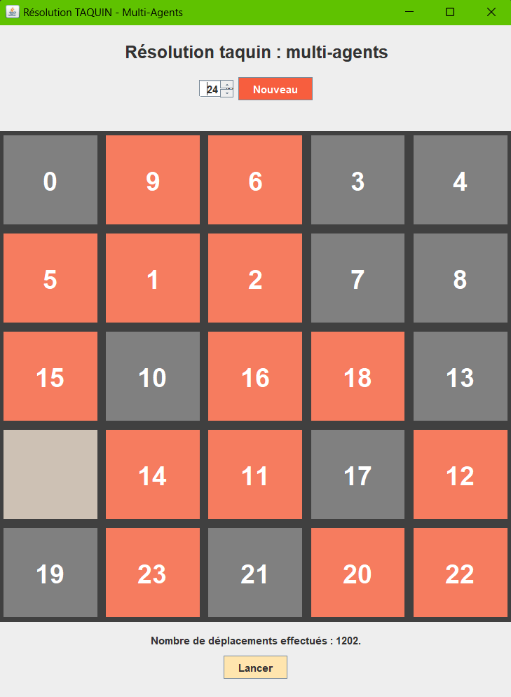

# Résolution Taquin -- IA Multi-Agents
## Introduction
Ce projet implémente un jeu de Taquin accompagné d'une **intelligence artificielle multi-agents** le résolvant facilement pour tous les cas carrés ou rectangulaires **compris entre 3x3 et 5x5**.  
De manière plus lente, il est **possible de résoudre des grilles de taille supérieur**. (6x6, 7x7, etc..)

### Caractéristiques
Language : Java  
Bibliothèque graphique : SWING  
Année : 2023

### Réalisation
- Fonctionnement métier du jeu Taquin
- Interface graphique
- Implémentation d'un système multi-agents
- Implémentation d'un système de messagerie entre agents
- Implémentation d'un solveur de grille

## Table des matières
1. [Arborescence du projet](#1---arborescence-du-projet)
2. [Présentation](#2---présentation)
3. [Fonctionnement du programme](#3---fonctionnement-du-programme)
4. [Résultats](#4---résultats)

## 1-- Arborescence du projet

- **Main.java** : Chargement du jeu.  
- **Grille.java** : Plateau de jeu du taquin.  
- **Agent** : Tuile de jeu du taquin fonctionnant en tant qu’agent autonome.  
- **Message.java** : Interface générale pour la gestion des messages de communication.  
- **MessageDemande.java** : Message envoyé entre les agents.  
- **Messagerie.java** : Boite de réception des messages pour les agents.  
- **Direction.java** : Enumération listant les directions possibles d’un agent.  
- **Position.java** : Classe gérant les opérations sur les positions spatiales des agents.  
- **Solveur.java** : Classe permettant de savoir si une grille donnée est résoluble ou non.  
- **vueTaquin.java**: Affichage graphique de notre projet.
- **/Rapport** : 
    - **capture_taquin.png** : Capture d'écran du jeu.  
    - **Rapport.pdf** : Rapport du projet.
    - **taquin24tuiles.mp4** : Vidéo de démonstration du jeu.

## 2-- Présentation
Le taquin est un jeu solitaire de logique consistant à déplacer des tuiles numérotées dans une grille 
afin de les placer dans un ordre spécifique. Dans sa version initiale, il se compose d’une grille 4x4 
remplis de 15 tuiles (numérotés de 1 à 15) à replacer dans un ordre croissant. 
> Notre version par défaut s'execute en 5x5 mais il est possible de changer la taille de la grille dans le fichier Main.java.

Bien que le taquin soit un jeu simple, il possède plusieurs propriétés mathématiques intéressantes dont la notion de grille 
solvable permettant déterminer si une configuration initiale est résolvable ou non.
> Ce mécanisme a été implémenté dans le fichier [Solveur.java](Solveur.java).

Dans le cadre de l’UE MIF16 – Techniques d’IA, ce projet a été réalisé avec une approche multi-agents de l’intelligence artificielle. Concrètement, cela signifie que le jeu ne 
se résout pas à travers un pilotage centralisé, mais plutôt via la mise en place d’agents autonomes
communiquant entre eux afin de parvenir à leurs objectifs.
> Plus concrètement, chaque tuile de jeu est réprésenté par un agent indépendant communiquant entre eux à travers un système de messagerie. Voir les fichiers 

## 3-- Fonctionnement du programme
Tout le fonctionnement du programme est détaillé au sein du fichier [Rapport.pdf](Rapport/Rapport.pdf).

## 4-- Résultats
- **Résolution complète** des taquins 3x3, 4x4 et 5x5 quelques soit leur nombre de tuiles.
- **Résolution complète** des taquins rectangulaires compris entre 3 et 5 case de largeur.
- **Résolution complète** des taquins 6x6 et 7x7 avec 90% des cases occupées par des tuiles
- **Résolution complète mais lente** des taquins 6x6 et 7x7 avec 100% des cases occupées par des tuiles

